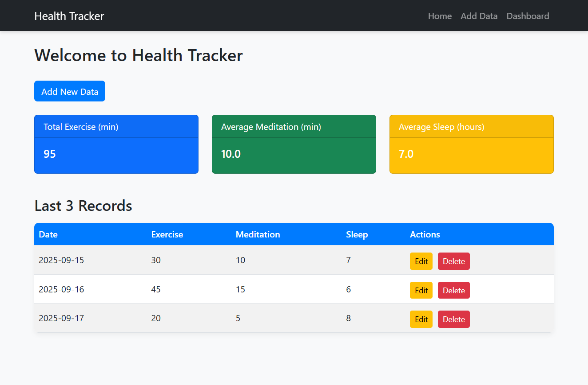

<p align="center">
  
  
  
  
  
  
</p>

# 🏥 Health Tracker

A simple **Flask** web application to **log and monitor daily health activities** including exercise, meditation, and sleep.  
It provides summaries, detailed records, and interactive charts to track your progress over time.

---

## 🌐 Live Demo

Check out the Health Tracker live application here:  
👉 [https://health-tracker-52ab.onrender.com/)

---

### ⚡ Features
- 🏠 **Home Page:** Shows total exercise, average meditation, average sleep, and last three records.
- ➕ **Add Data:** Log daily health metrics through a simple form.
- 📊 **Dashboard:** View all records with interactive Chart.js line charts.
- ✏️ **Edit/Delete:** Update or remove any record.
- 🌐 **Responsive UI:** Works well on desktop, tablet, and mobile devices.

---

### 🛠️ Technologies Used
- 🐍 **Python & Flask**
- 🗄️ **PostgreSQL**
- 📊 **Chart.js**
- 🎨 **Bootstrap 5**
- 🔑 **dotenv**
- 🔧 **Jinja2**

---


## 💻 Installation & Setup

```bash
# Clone the repository
git clone <your-repo-link>
cd Health_Tracker

# Create virtual environment
python -m venv venv

# Activate environment
# Windows
.\venv\Scripts\activate
# macOS/Linux
source venv/bin/activate

# Install dependencies
pip install -r requirements.txt


## 🖼️ Demo Screenshot

# Clone the repository
git clone <your-repo-link>
cd Health_Tracker

# Create virtual environment
python -m venv venv

# Activate environment
# Windows
.\venv\Scripts\activate
# macOS/Linux
source venv/bin/activate

# Install dependencies
pip install -r requirements.txt


## 🖼️ Demo Screenshot




Health_Tracker/
├── app.py
├── templates/
│   ├── base.html
│   ├── index.html
│   ├── dashboard.html
│   ├── form.html
│   └── edit.html
├── static/
│   └── style.css
├── .env
├── requirements.txt
├── Procfile
└── README.md


Health_Tracker/
├── app.py
├── templates/
│   ├── base.html
│   ├── index.html
│   ├── dashboard.html
│   ├── form.html
│   └── edit.html
├── static/
│   └── style.css
├── .env
├── requirements.txt
├── Procfile
└── README.md
